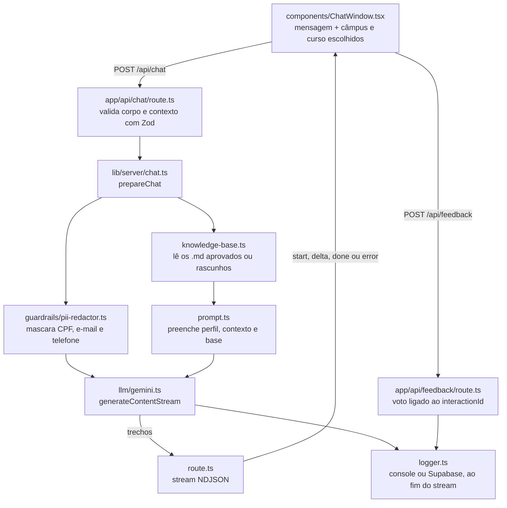

# Fluxo do chat

Voltar ao [[00 Índice]]. Arquivos citados: [[Mapa do código]]. Decisão: [[DEC-016 Streaming, feedback por resposta e contexto de câmpus e curso]].

## Como está hoje

1. A tela envia `conversationId`, `message`, o histórico (só mensagens completas que deram certo) e, se escolhido, `context` com câmpus e curso.
2. A rota valida os dados e recusa câmpus e curso que não existem juntos. Erros antes da resposta (variáveis, base, prompt) voltam como JSON 500; em desenvolvimento, com detalhe.
3. `prepareChat` anonimiza as mensagens do usuário, normaliza o histórico, lê a base e monta o prompt com o contexto ("não informado" quando não há escolha).
4. A rota devolve um stream NDJSON. O primeiro evento, `start`, traz o `interactionId` e se houve dado mascarado.
5. O Gemini responde em trechos (`delta`). Se o modelo principal falhar com 429 ou 5xx antes do primeiro trecho, entra o próximo modelo da lista. O SDK não repete chamadas por conta própria.
6. No fim vem `done`, ou `error` com a mensagem padrão. Enquanto a resposta chega, a tela esconde a linha "Fonte:" e mostra um cursor; no fim, os chips de fonte e os botões "Essa resposta ajudou?".
7. O log é gravado quando o stream termina, inclusive se o navegador cancelar. Vai para o console até existir sessão e Supabase configurado.
8. O voto vai para `/api/feedback` e é registrado com o `interactionId`.

## O que ainda não existe
- Sessão e seletor de perfil: [[DEC-004 Sessão simulada por seletor de perfil]]
- Ferramentas de documento e desambiguação: [[DEC-005 O modelo nunca recebe o identificador do usuário]]
- Regra de sensíveis antes do modelo: [[Segurança e privacidade]]
- Fallback para o Groq ([[Pendências]])

Fluxo completo planejado: [[README#5.2 Fluxo de uma dúvida institucional]] e [[README#5.3 Fluxo de pedido de documento com desambiguação]].
